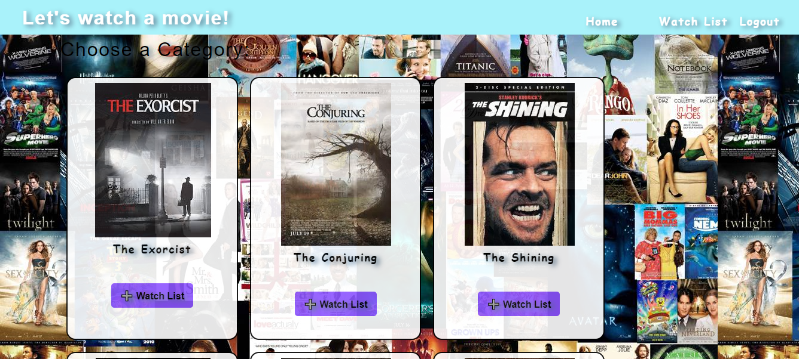
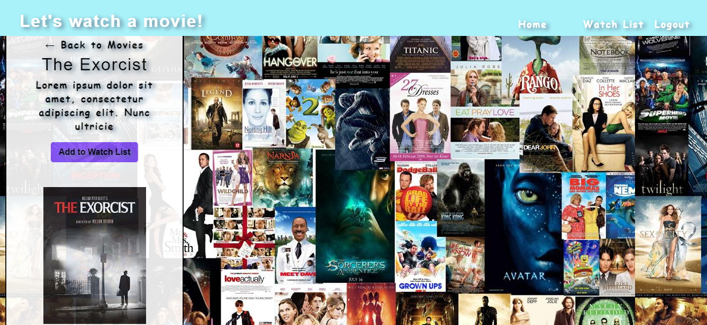
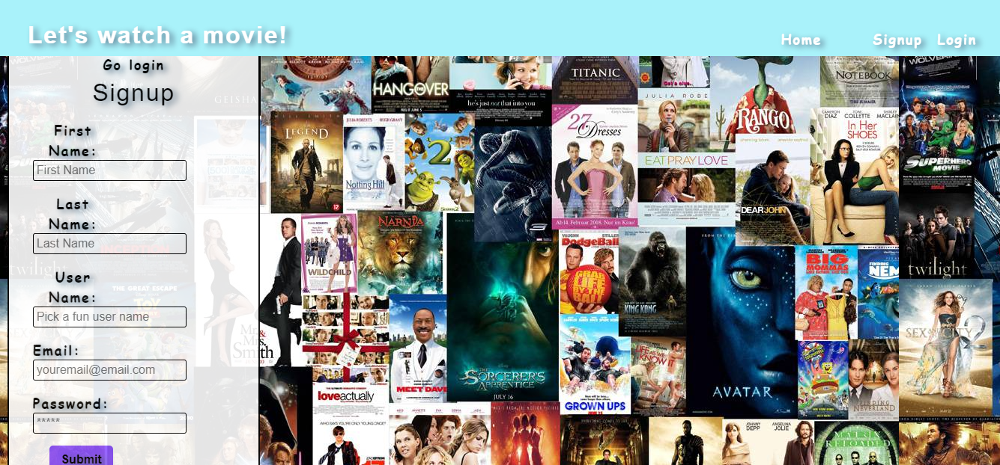
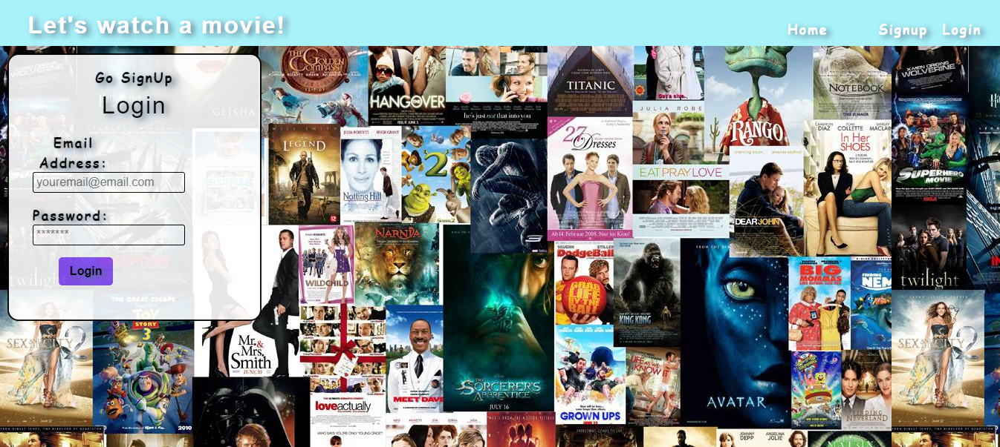

# Movie Maniac

# Table of Contents

-[Description](#description)
-[Usage](#useage)
-[Languages](#languages)
-[Collaborators](#collaborators)
-[License](#license)
-[Links](#links)
-[Questions](#questions)

 ## Description:
 
 Please be advised this is not a working app. However, when it does work 100%. This is Movie Maniac! A social media app where movie lovers can 
 come together and discuss movies! You'll be able to add movies to you watchlist and comment on movies.
 
 ## Usage:
 this is deployed on a live url so it doesn't need any installs. however, if you are pulling code off github please npm i  from the root of the app before use. then npm run dev to start the app. you may also have to cd into client and server and npm i in both to download all the packages.

## languages:
redux 
react
apollo-boost
graphql
react-dom
react-redux
react-router-dom

 ## Picture:
 
 
 
 
 
 ## License
 For more info about the License, click on the link below.

 ## Links
 Link to the GitHub 
[link](https://github.com/chattean/movie-maniac)
Link to the deployed project
[link](https://weareallmoviemaniacs.herokuapp.com)

## Contributing
Natasha Mullin [link](github.com/natashamullin)
Anuj Chatterjee [link](github.com/chattean)

## Questions 
please reach me at my GubHub account or through Email if you have any questions
Natasha Mullin; [link](github.com/natashamullin)
[link](Natashamullin0826889@yahoo.com)
[link](anujchatterjee@gmail.com)
